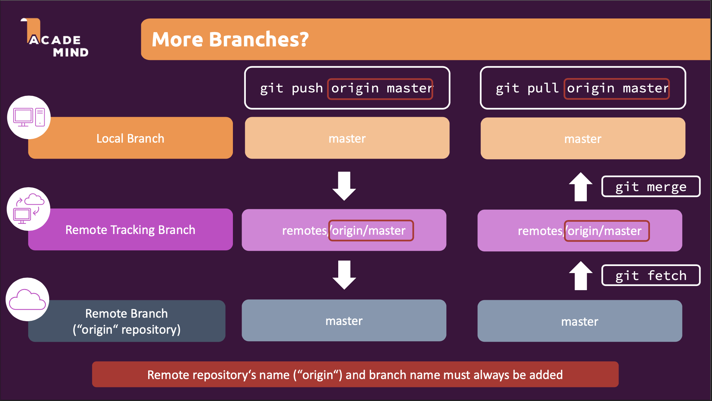

# From Git to GitHub Cheatsheet
<!-- toc -->

<!-- tocstop -->

## how git push and git pull actually work

the command `git push` and `git pull` first update the remote tracking branch then only update the remote branch

`git branch` show only local branch    
`git branch -a` show all branches, including local and remote tracking branches     
`git branch -r` show only remote tracking branch   
`git ls-remote` to check what branches are there on github    

## To push commit to remote
`git push origin <branch_name>`

## Create branch that alrdy on Github
say now you have a branch that somehow is only on GitHub but not locally, how do you create a local tracking branch to work on it?    
    
You can first create a local branch referring to the remote branch
`git branch --track <branch_name> origin/<branch_name>`    
the branch name should be consistent

